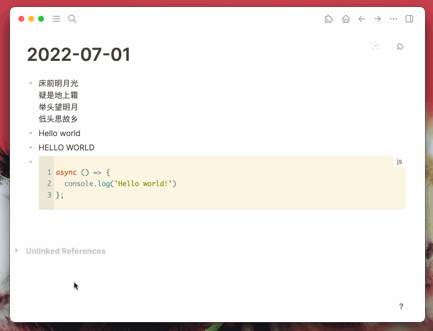

# Google fonts for Logseq

A Logseq plugin to use [Google Fonts](https://fonts.google.com/) for rendering.

Google fonts have more than 1400+ fonts which can be used in Logseq now. You can choose handwriting fonts for main notes and monospace fonts for code blocks.

## Features

- Support page title, main content and code block settings.
- Support font family, font size, font weight and font color settings.
- Support any web font.

## Buy me a coffee

If my plugin solve your situation a little bit and you will, you can choose to buy me a coffee via [this](https://www.buymeacoffee.com/vipzhicheng) and [this](https://afdian.net/@vipzhicheng).

## Licence
MIT
